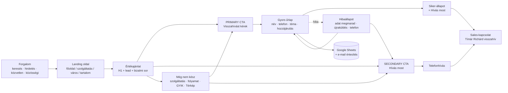

# Konverziós funnel-térkép

Két fő konverziós cél, minden kereskedelmi oldalon ugyanabban a sorrendben és súllyal:

| Prioritás | Cél | Felirat | Mi történik a kattintás után |
|---|---|---|---|
| **PRIMARY** | Visszahívás-kérés | „Visszahívást kérek” | Azonnal megnyílik a rövid űrlap (modál; telefonon alsó panel). Nincs átnavigálás. |
| **SECONDARY** | Telefonhívás | „Hívás most” (mobil) · „Hívás: +36 20 369 5312” (desktop) | `tel:+36203695312` — a telefon tárcsázót nyit. |
| harmadlagos | Önkiszolgáló számolás | „Előbb számolnál? Pénzügyi Térkép / kalkulátor” | Szöveges link, nem gomb. Aki még nem kész, itt melegszik fel; a végén ugyanúgy lead-űrlap van. |

A telefonszám és minden elérhetőség egy helyről jön: `js/config.js → contact`.

---

## A teljes lánc



| Szakasz | Hol valósul meg | Mérés (dataLayer) |
|---|---|---|
| Forgalom | keresés, Google Ads, Facebook, közvetlen | `landing_page`, `referrer_host`, `utm_*` (sessionStorage, a munkamenet végéig) |
| Landing | 32 indexelhető oldal | `page_type`, `service`, `city` (a `<html data-*>` attribútumaiból) |
| CTA | hero, header, mobil sáv, szekció-CTA-k, záró CTA | `cta_callback_click`, `cta_call_click` + `cta_location` |
| Űrlap | modál / kapcsolat oldal / funnel-eredmény | `lead_form_view` → `lead_form_start` → `lead_form_submit` |
| Siker / hiba | ugyanabban a komponensben | `lead_form_success` / `lead_form_error` (`error_type`: validation · network · offline) |
| Sales-kapcsolat | Google Sheets sor + e-mail, benne a **Kontextus** | a lead-sorban: `form_type`, `cta_location`, oldaltípus, szolgáltatás, város, landing, UTM |

> **Hívás = mikrokonverzió.** A `cta_call_click` azt méri, hogy valaki megnyomta a hívás
> gombot — nem azt, hogy a hívás létrejött. Valódi hívásméréshez call tracking kell
> (lásd `CRO-TEST-ROADMAP.md` és `OWNER-DATA-NEEDED.md`).

---

## Oldalak helye a funnelben

| Oldal | Szerep | CTA-pontok (cta_location) |
|---|---|---|
| `/` főoldal | márka + belépő | header · hero · Pénzügyi Térkép (funnel) · process · about · final · mobile_sticky |
| `/szolgaltatas/*.html` (13) | kereskedelmi landing (téma előre kijelölve) | header · hero · kalkulátor-funnel · service_section · process · final · mobile_sticky |
| `/penzugyi-tanacsadas/{8 város}/` | SEO + konverziós landing (város a leadben) | header · hero · mid_page · Térkép · final · mobile_sticky |
| `/penzugyi-tanacsadas/` pillar | „mi ez, mennyibe kerül” — mérlegelő | header · hero · Térkép · final · mobile_sticky |
| `/penzugyi-tervezes/` | mérlegelő, „Teljes átnézés” téma előre kijelölve | header · hero · Térkép · final · mobile_sticky |
| `/penzugyi-tanacsadas/varosok/` | hub → városi oldalak | header · hero · Térkép · final · mobile_sticky |
| `/rolam/` | bizalom (E-E-A-T) | header · hero · final · mobile_sticky (a sáv betöltéskor látszik, mert a hero CTA a portré alatt van) |
| `/kapcsolat/` | **beágyazott űrlap** (`#visszahivas`) — minden CTA JS nélküli célpontja | header · hero (→ ide görget) · contact_form · Térkép · mobile_sticky |
| `/tudastar/` + cikkek | információs (blog) | header · hero (kisebb gombok) · blog (záró CTA + híd a kapcsolódó szolgáltatásra) · mobile_sticky |
| impresszum, adatkezelés | jogi | csak header (telefon + visszahívás) |
| 404 | mentőöv | 404 CTA-pár + linkek a témákra / Térképre |

---

## 1. Főoldal-funnel

```
Keresés / közvetlen / Facebook
  → Főoldal hero: „Az állam évente több százezer forintot ad vissza”
      ├─ [Visszahívást kérek] → modál → siker            (2 lépés + 2 mező)
      ├─ [Hívás most] → tel:                             (1 koppintás)
      └─ „Előbb számolnál? Pénzügyi Térkép” → 7 kérdés → 3 téma + űrlap → siker
  → görgetés: Térkép · statok · 13 téma · „Négy lépés” [CTA] · Rólam [CTA] · GYIK
  → Záró CTA (lime szalag) [Visszahívást kérek] [Hívás]
```

## 2. Szolgáltatás-funnel (13 oldal)

```
Keresés („otthon start kalkulátor”, „kgfb váltás” …) / hirdetés
  → Hero: H1 + hook + [Visszahívást kérek] [Hívás] + „kalkulátor — 3 kérdés”
      ├─ Visszahívás → modál, a téma (pl. „Támogatott hitelek”) ELŐRE KIJELÖLVE → siker
      └─ Kalkulátor (jobb hasáb / alatta): 3 kérdés → számítás → eredmény + űrlap → siker
  → „Így működik” (a termék)  → „Kinek szól” [CTA: service_section]
  → „Mi történik, ha visszahívást kérsz?” 3 lépés + bizalmi kártya (név, OVB/MNB, díjazás) [CTA: process]
  → GYIK → jogi megjegyzés, kapcsolódó útmutatók
  → Záró CTA: „<Téma>: nézzük meg a te számaiddal.” [CTA: final] + híd a Térképre
```

## 3. Városi funnel (8 oldal)

```
Keresés („pénzügyi tanácsadó Debrecen”)
  → Hero: H1 + helyi lead + meta (online/személyesen · 0 Ft díj · hétköznap 9–19)
      + [Visszahívást kérek] [Hívás] + bizalmi sor
  → Helyi bevezető → 4 helyi téma (link a szolgáltatás-oldalakra)
  → „A konzultáció menete” 4 lépés + ki vagyok [CTA: mid_page]
  → GYIK → Pénzügyi Térkép (városi CTA-szöveggel) → útmutatók
  → Záró CTA: „Pénzügyi tanácsadás Debrecenből — kérj visszahívást.” [CTA: final]
Minden lead: city=<slug> a Kontextusban és a GA4-eseményekben.
Nincs helyi telefonszám, iroda vagy cím — egy szám, egy tanácsadó.
```

## 4. Blog-funnel (tudástár)

```
Információs keresés („háztartási költségvetés”, „pénzügyi tanácsadó ellenőrzése”)
  → Cikk (hero-ban kisebb CTA-pár — nem agresszív)
  → Tartalom, források
  → Záró blokk: „Kérdésed maradt a témában?” [Visszahívást kérek] [Hívás]
      + híd: kapcsolódó szolgáltatás-oldal kalkulátorral (vagy: „ellenőrizz engem is” → /rolam/)
```

## 5. Mobil funnel

```
Első képernyő: H1 + lead + [Visszahívást kérek] (teljes szélesség) + [Hívás most]
  → görgetéskor: alsó konverziós sáv [Hívás] [Visszahívást kérek]
       - akkor látszik, ha a hero CTA nincs a képben (fölötte VAGY még alatta)
       - eltűnik, ha funnel-léptető / beágyazott űrlap van a képben, vagy ha a
         látogató mezőbe gépel (billentyűzet)
       - home indicator fölött (safe-area), a süti-banner a sáv fölé kerül
  → Visszahívás → alsó panel (bottom sheet): név, telefon (numerikus billentyűzet),
    téma, hozzájárulás → [Visszahívást kérek] → siker + [Hívás most]
  → Menü (burger): legfelül [Visszahívást kérek] [Hívás]
```

Desktop: a fejlécben mindig kéznél van a telefon (1280 px felett a szám kiírva, alatta
ikon) és a „Visszahívást kérek” gomb; a modál középen, max. 560 px széles.
